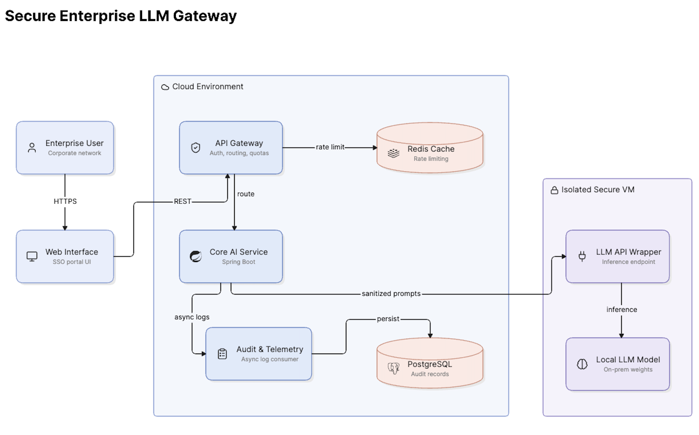

# System Architecture

This document outlines the high-level architecture of the Secure Enterprise LLM Gateway. The design focuses on security, traceability, and isolation, ensuring that non-deterministic AI models can be utilized safely within a strict corporate environment.

## High-Level Architecture Diagram

*Diagram generated using [Eraser.io](https://www.eraser.io)*

## Component Breakdown

### 1. API Gateway Service (Spring Cloud Gateway)
- **Responsibility:** Acts as the single entry point for all client requests.
- **Enterprise Features:** 
  - Validates authentication (e.g., JWT).
  - Enforces rate limiting using Redis to prevent denial-of-service or excessive resource consumption.
  - Routes traffic to downstream microservices.

### 2. Core AI Service (Spring Boot)
- **Responsibility:** The brain of the operation. Manages the business logic before and after the LLM interaction.
- **Enterprise Features:**
  - **Prompt Sanitization:** Strips or masks Personally Identifiable Information (PII) before the prompt leaves the secure ecosystem.
  - **Response Validation:** Checks the LLM output for formatting or banned keywords before returning it to the user.

### 3. Audit & Telemetry Service (Spring Boot)
- **Responsibility:** Maintains an immutable log of all AI interactions.
- **Enterprise Features:**
  - Asynchronously records who asked what, when, and what the model replied.
  - Crucial for compliance, debugging, and identifying hallucination trends in the non-deterministic model.

### 4. LLM Virtual Machine
- **Responsibility:** Hosts the actual Large Language Model (e.g., Llama 3) entirely locally.
- **Enterprise Features:**
  - Completely isolated from the public internet.
  - Ensures proprietary bank data never traverses third-party APIs (like OpenAI).